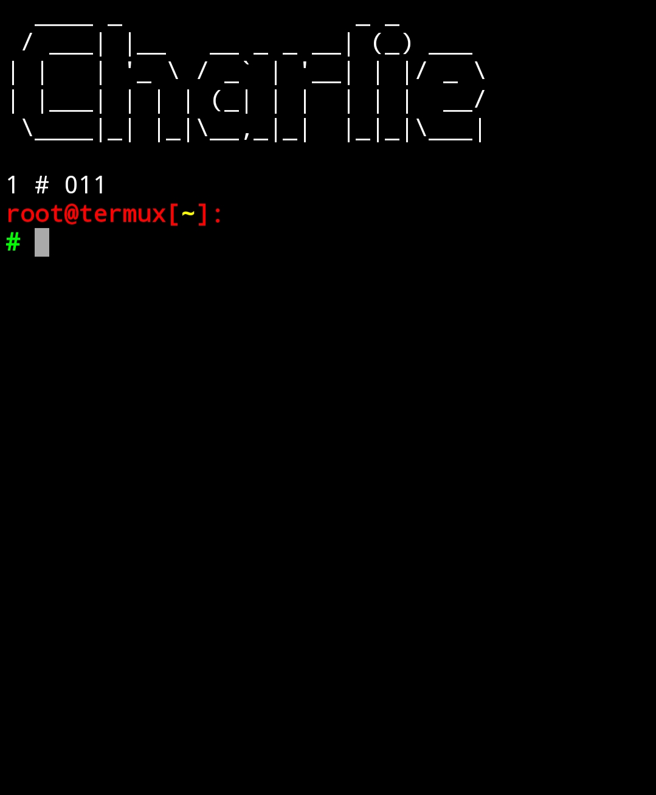

# Cute-Termux
# Made By Charlie : The hacker
### This script will make your termux look better. Enjoy! ! 

#### Installing

1. git clone https://github.com/CharlieTheHack1/Cute-Termux
2. chmod +x *
2. ./setup.sh

#### Updating

1. use command **updatedw** to update the script.

#### Uninstalling
1. Run the script again to uninstall styling.

